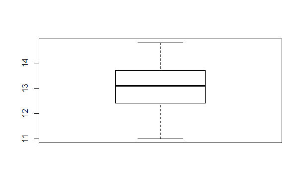
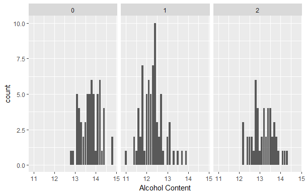
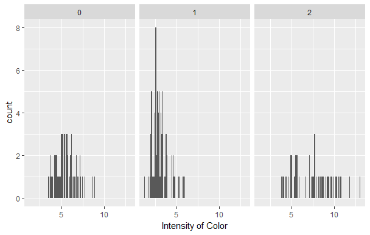
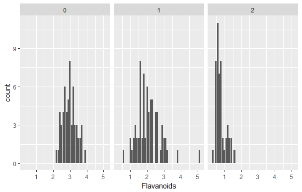
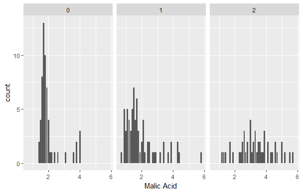
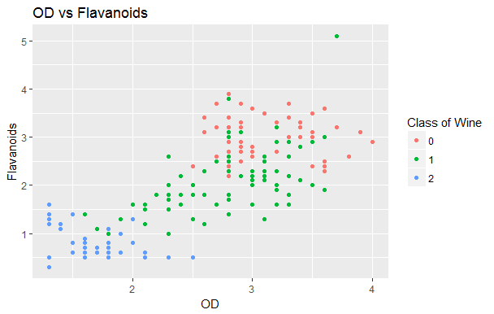
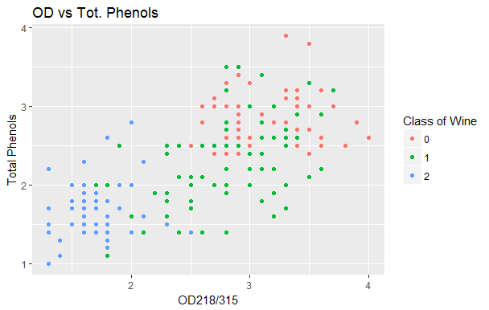

# WineAnaly
This project analyses the various factors which can be used to classify wines into three classes.
It studies the different properties across the 3 different classes, tries to find relations amongst them 
and predicts the class from the property variants.

## Structure of dataset

Initially we start by looking at the data present in the Dataset.

```
'data.frame':	178 obs. of  15 variables:
 $ Al       : num  11.6 12.6 14.1 14.1 13.8 ...
 $ Mal      : num  2.05 1.29 4.1 1.63 1.53 3.87 1.81 1.34 1.13 1.6 ...
 $ Ash      : num  3.23 2.1 2.74 2.28 2.7 2.4 2.41 1.9 2.16 2.52 ...
 $ Alc      : num  28.5 20 24.5 16 19.5 23 20.5 18.5 19 17.8 ...
 $ Mg       : int  119 103 96 126 132 101 100 88 87 95 ...
 $ TotP     : num  3.18 1.48 2.05 3 2.95 2.83 2.7 1.45 3.5 2.48 ...
 $ Flav     : num  5.08 0.58 0.76 3.17 2.74 2.55 2.98 1.36 3.1 2.37 ...
 $ NFlav    : num  0.47 0.53 0.56 0.24 0.5 0.43 0.26 0.29 0.19 0.26 ...
 $ Pro      : num  1.87 1.4 1.35 2.1 1.35 1.95 1.86 1.35 1.87 1.46 ...
 $ Color    : num  6 7.6 9.2 5.65 5.4 2.57 5.1 2.45 4.45 3.93 ...
 $ Hue      : num  0.93 0.58 0.61 1.09 1.25 1.19 1.04 1.04 1.22 1.09 ...
 $ OD       : num  3.69 1.55 1.6 3.71 3 3.13 3.47 2.77 2.87 3.63 ...
 $ Prl      : int  465 640 560 780 1235 463 920 562 420 1015 ...
 $ Class    : chr  "two" "three" "three" "one" ...
 
 ```
 There are 178 observations and 15 features. Input variables which includes 15 chemical and physical features of wine.

Below is brief description of each feature: Input variables (based on physicochemical tests):

Chemical and Physical Properties:

* Alcohol: The percent alcohol content of the wine (% by volume)

* Malic Acid : It is one of the principal organic acids found in wine grapes (g/l)

* Ash : Ash content is one of the important indicators in wine quality determination (mS/cm)

* Alcalinity : Several different types of acids found in wine affect how acidic a wine tastes. (pH)

* Magnesium : Magnesium content in wines (gm per 1kg)

* Total phenols : These are flavonoids that contribute to the construction of various tannins and contribute to the perception of bitterness in wine. (mg/L)

* Flavanoid : Flavonoids are the most abundant polyphenols in the wine. (mg/L)

* Non Flavanoid Phenols : Phenolic compounds in wine contribute specific characteristics to wine while also creating specific flavors and aromas when the complex interactions take place in wine during fermentation and wine-making. (mg/L)

* Proanthocyanidins : A class of Phenol . (mg/L)

* Color intensity : A simple measure of how dark the wine is.

* Hue : It is one of the main properties of color.

* OD280/ OD315 of Diluted Wine .

* Proline : An amino-acid . (mg/L)

Output variable :

class ( classified into one, two and three )
 
### Summary of the Dataset
```
       Al             Mal             Ash             Alc              Mg        
 Min.   :11.03   Min.   :0.740   Min.   :1.360   Min.   :10.60   Min.   : 70.00  
 1st Qu.:12.36   1st Qu.:1.603   1st Qu.:2.210   1st Qu.:17.20   1st Qu.: 88.00  
 Median :13.05   Median :1.865   Median :2.360   Median :19.50   Median : 98.00  
 Mean   :13.00   Mean   :2.336   Mean   :2.367   Mean   :19.49   Mean   : 99.74  
 3rd Qu.:13.68   3rd Qu.:3.083   3rd Qu.:2.558   3rd Qu.:21.50   3rd Qu.:107.00  
 Max.   :14.83   Max.   :5.800   Max.   :3.230   Max.   :30.00   Max.   :162.00  
      TotP            Flav           NFlav             Pro            Color       
 Min.   :0.980   Min.   :0.340   Min.   :0.1300   Min.   :0.410   Min.   : 1.280  
 1st Qu.:1.742   1st Qu.:1.205   1st Qu.:0.2700   1st Qu.:1.250   1st Qu.: 3.220  
 Median :2.355   Median :2.135   Median :0.3400   Median :1.555   Median : 4.690  
 Mean   :2.295   Mean   :2.029   Mean   :0.3619   Mean   :1.591   Mean   : 5.058  
 3rd Qu.:2.800   3rd Qu.:2.875   3rd Qu.:0.4375   3rd Qu.:1.950   3rd Qu.: 6.200  
 Max.   :3.880   Max.   :5.080   Max.   :0.6600   Max.   :3.580   Max.   :13.000  
      Hue               OD             Prl            Class           class_num
 Min.   :0.4800   Min.   :1.270   Min.   : 278.0   Length:178         1:59     
 1st Qu.:0.7825   1st Qu.:1.938   1st Qu.: 500.5   Class :character   2:71     
 Median :0.9650   Median :2.780   Median : 673.5   Mode  :character   3:48     
 Mean   :0.9574   Mean   :2.612   Mean   : 746.9                               
 3rd Qu.:1.1200   3rd Qu.:3.170   3rd Qu.: 985.0                               
 Max.   :1.7100   Max.   :4.000   Max.   :1680.0

```


Above figure shows the distribution of data over different variables. As we can see, the normal range for fixed acidity is 12.36 to 13.68 percent. As for malic acid, 75% of wines in our dataset have below 3.083 mg of malic acid in their content. Also, the Average alcohol percentage in our dataset is about 13.


### Plottings

Boxplot of Alcohol Content Percent :


For most of the wine in our dataset, alcohol percentage falls between 12 and 14. 

#### Distribution of Data : Alcohol, Color , Flavanoids and Malic Acid

Distribution of Acohol percentages and Color of intensity across the three classes is shown - 



Alcohol Content :

Class 1 : 13 - 14.5 %

Class 2 : 11.5 - 13 %

Class 3 : 12 - 14.5 % .

We see there is a relation between the alcohol content and the class of wine . 

Intensity of Color : 

Class 1 have a moderate level of color ( 4-8 )

Class 2 seem to be lightly colored ( 1-6 )

Class 3 are darker in color ranging from 4 - 11 in intensity of color.

Distribution of Flavanoids and Malic Acid is shown - 



Flavanoid Content appears to be moderately low in Class 1 wines ( 1-3 mg/L )

In class 2 wines it ranges from 0.5 - 4 mg/L .

In class 3 type of wines, it is spread from 1 - 6 mg/L . 


####  Analysizing correlation between Class and Input variables

We use Spearman's rho statistic to estimate a rank-based measure of association. Correlations falls between -1 and 1. 0 suggests there is no association between the two variables while numbers close to -1 or 1 suggests strong negative and positive associations accordingly.


```
> cor(wine[,1:13], wine$class_num)
             [,1]
Al    -0.33044357
Mal    0.43945626
Ash   -0.04142315
Alc    0.51785911
Mg    -0.20917939
TotP  -0.71949973
Flav  -0.84616171
NFlav  0.46064788
Pro   -0.50040328
Color  0.26682296
Hue   -0.60598251
OD    -0.78604206
Prl   -0.63371678
```

This shows that Wine Class has a positive correlation with Alcalinity and Malic Acid and negative correlation with OD280/OD315 , Flavanoids and Total Phenols .

The following diagram gives us a good sense of the distribution and correlation among input variables in our dataset:


A few of the observations from the above diagram - 

* Positive correlation between Flavanoids and Total Phenols

* Positive correlation between OD280/OD315 and Total Phenols

* Positive correlation between OD280/OD315 and Flavanoids

* Positive correlation between Intensity of Color and Alcohol Content

* Negative correlation between Non Flavanoid Phenols and Flavanoids

* Negative correlation between OD280/OD315 and Non Flavanoid Phenols

To avoid multicollinearity in model building using regressions, we have to be aware of strong correlations among input variables.

#### 2 Variables are plotted for each Class of the wine

##### Flavanoid and OD280/od315 are plotted for each Class of wine 



The graph shows that low values of both variables are found in class 1 wines , moderately valued characteristics are displayed by class 2 wines and wines having high values of Flavanoids and OD belong to Class 3.

###### Flavanoid and Total Phenols are plotted by Class of wine 


The graph shows that all wines show high total phenol content, however class 3 wines hve higher content than the rest of the classes

Class 1 type of wines have low Flavanoid levels while class 2 and class 3 have higher portions of Flavanoids in them.

##### Total Phenols and OD280/OD315 are plotted by the Class of wine .



We learn from this graph that Class 1 wines have low values of OD and Total Phenols which is also what we learnt from previous graphs.

However, Class 2 and Class 3 type of wines show higher levels of OD280/OD315 and Class 3 types of wines in particular have higher values of Total Phenols.

#### Analyzing Correlation among input variables in the dataset
